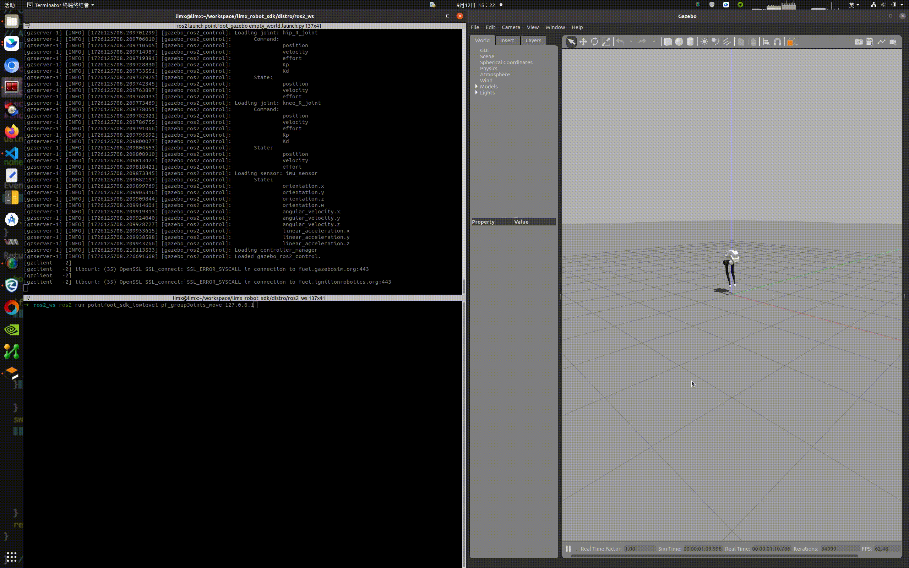

# English | [简体中文](README.md)
# pointfoot-gazebo-ros2

## 1. Set up the Development Environment 

Install ROS 2 Humble: Set up a ROS 2 Humble-based algorithm Development Environment on the Ubuntu 22.04 operating system. For installation, please refer to the documentation: https://docs.ros.org/en/humble/Installation/Ubuntu-Install-Debians.html, and choose "ros-humble-desktop" for installation. After the installation of ROS 2 Humble is completed, enter the following Shell commands in the Bash end point to install the libraries required by the Development Environment:
```
sudo apt update
sudo apt install ros-humble-urdf \
             ros-humble-urdfdom \
             ros-humble-urdfdom-headers \
             ros-humble-kdl-parser \
             ros-humble-hardware-interface \
             ros-humble-controller-manager \
             ros-humble-controller-interface \
             ros-humble-controller-manager-msgs \
             ros-humble-control-msgs \
             ros-humble-controller-interface \
             ros-humble-gazebo-* \
             ros-humble-rviz* \
             ros-humble-rqt-gui \
             ros-humble-rqt-robot-steering \
             ros-humble-plotjuggler* \
             ros-humble-control-toolbox \
             ros-humble-ros2-control \
             ros-humble-ros2-controllers \
             ros-dev-tools \
             cmake build-essential libpcl-dev libeigen3-dev libopencv-dev libmatio-dev \
             python3-pip libboost-all-dev libtbb-dev liburdfdom-dev liborocos-kdl-dev -y
```

## 2. Create Workspace

You can create an algorithm development workspace by following these steps: 
- Open a Bash end point.
- Create a new directory to store the workspace. For example, you can create a directory named "limx_ws" under the user's home directory:

  ```
  mkdir -p ~/limx_ws/src
  ```

- Download the robot model description file

  ```
  cd ~/limx_ws/src
  git clone https://github.com/limxdynamics/robot-description.git
  ```

- Download the Motion Control Development Interface:

  ```
  cd ~/limx_ws/src
  git clone https://github.com/limxdynamics/limxsdk-lowlevel.git
  ```

- Download Visualization Tool

  ```Bash
  cd ~/limx_ws/src
  git clone https://github.com/limxdynamics/robot-visualization.git
  ```

- Download Gazebo Simulator:

  ```
  cd ~/limx_ws/src
  git clone -b feature/humble https://github.com/limxdynamics/pointfoot-gazebo-ros2.git
  ```

- Compile Project:

  ```
  cd ~/limx_ws
  source /opt/ros/humble/setup.bash
  colcon build --cmake-args -DCMAKE_BUILD_TYPE=Release
  ```

- Select robot type
  - List available robot types via the Shell command tree -L 1 src/robot-description/pointfoot : 

    ```
    src/robot-description/pointfoot
    ├── PF_P441A
    ├── PF_P441B
    ├── PF_P441C
    ├── PF_P441C2
    ├── PF_TRON1A
    ├── SF_TRON1A
    └── WF_TRON1A
    ```

  - TakingPF_P441C (please replace it according to the actual robot type) as an example, set the robot model type:

    ```
    echo 'export ROBOT_TYPE=PF_P441C' >> ~/.bashrc && source ~/.bashrc
    ```

- Run the simulation: You can set the use_support parameter of the empty_world.launch.py file to true, and execute the following Shell command to run the simulation:

  ```
  source /opt/ros/humble/setup.bash
  source install/setup.bash
  ros2 launch pointfoot_gazebo empty_world.launch.py
  ```

- Run the control routine to ensure that the robot in the simulator is moving, indicating that the simulation environment has been successfully set up:

  ```
  source /opt/ros/humble/setup.bash
  source install/setup.bash
  ros2 run limxsdk_lowlevel pf_groupJoints_move 127.0.0.1
  ```

  
